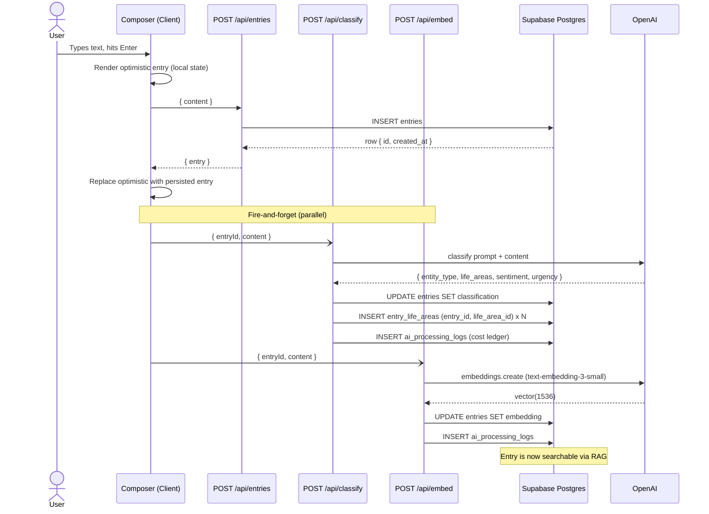

# Flow 001: Capture → Classify → Embed

## Goal
User dumps thought into Shadow. System acknowledges instantly, structures it asynchronously, makes it retrievable from RAG queries within seconds.

## Actor
Authenticated user on `/inbox` or any page with the global Composer.

## Sequence

## Files
- `src/components/inbox/Composer.tsx` — UI entry point
- `src/lib/entries/local.ts` — optimistic local state
- `src/lib/entries/useEntries.ts` — hook managing local + server sync
- `src/app/api/entries/route.ts` — persist entry
- `src/app/api/classify/route.ts` — call LLM, write classification
- `src/app/api/embed/route.ts` — call embeddings API, write vector
- `src/ai/prompts/classification.ts` — system prompt
- `src/lib/cost-ledger.ts` — token + USD logging

## Timing (real-world)
| Step | Duration |
|------|---------|
| Optimistic render | < 16ms |
| `POST /api/entries` | 80–200ms |
| `POST /api/classify` | 400–1200ms (gpt-4o-mini) |
| `POST /api/embed` | 150–400ms |

User perceives sub-200ms entry; structuring lands in background.

## Edge Cases

### Network failure on entries write
- Optimistic entry remains visible with "Failed to save · retry" badge
- Client queues retry on next online event (`navigator.onLine`)

### Classification fails
- Entry persists without classification fields (null)
- Re-classify available from entry detail menu
- Cost ledger writes the failed call (cost = 0)

### Embed fails
- Entry persists without `embedding` vector
- Excluded from RAG until re-embedded
- Background sweep job (future) catches null embeddings

### Budget exceeded mid-day
- Classify + embed return 402
- Entry still persists (free path)
- UI banner: "Shadow needs rest. Classification will resume tomorrow."

### Duplicate submission (double-click)
- Composer disables submit during in-flight request
- Server-side: no dedup (acceptable — duplicates are user-visible and recoverable)

## Invariants
- Entry persistence never blocks on AI calls
- Cost ledger writes happen for every AI call, success or failure
- RLS enforces `user_id = auth.uid()` on all three tables
- Classification can re-run; embedding can re-run; both are idempotent at the row level
