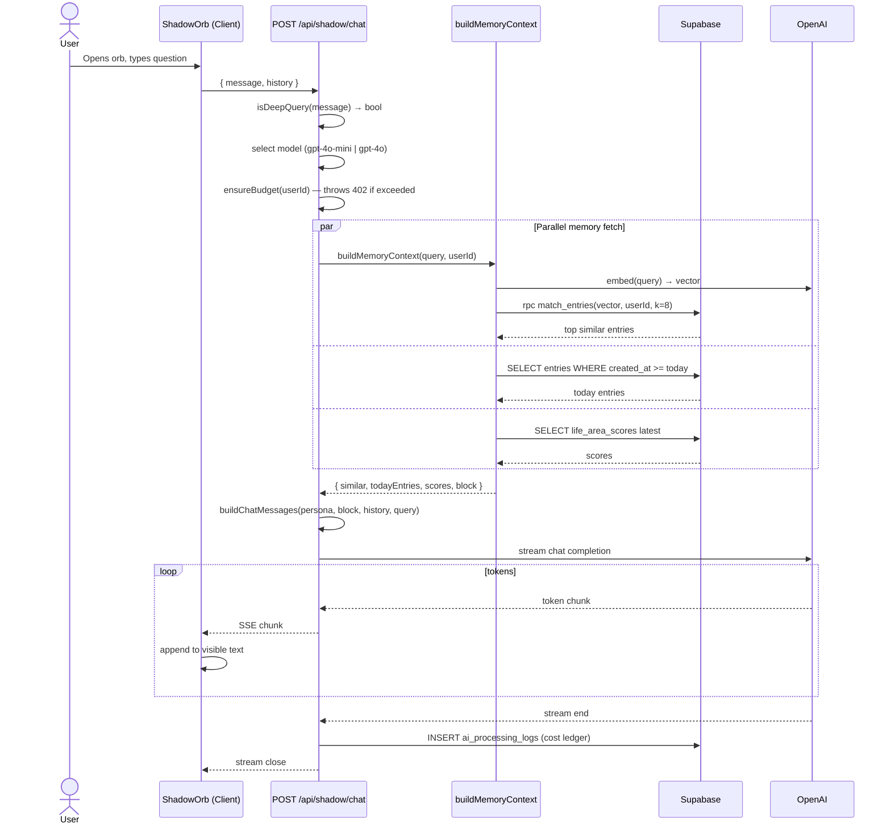

# Flow 002: ShadowOrb RAG chat

## Goal
User asks Shadow a question about their own life ("почему мне последнее время хреново?"). Shadow retrieves relevant past entries + current state, synthesizes a grounded answer, streams it back.

## Actor
Authenticated user clicking the ShadowOrb floating action button on any page.

## Sequence

## Files
- `src/components/ShadowOrb.tsx` — floating UI
- `src/app/api/shadow/chat/route.ts` — endpoint
- `src/lib/memory/context.ts` — `buildMemoryContext` orchestrator
- `src/lib/rag.ts` — `searchSimilarEntries`, `buildMemoryBlock`
- `src/lib/embeddings.ts` — OpenAI embeddings wrapper
- `src/ai/prompts/shadow-chat.ts` — persona prompt + `isDeepQuery`
- `src/lib/llm.ts` — model selection + streaming
- `src/lib/cost-ledger.ts` — budget enforcement

## Timing
| Step | Duration |
|------|---------|
| Embed query | 100–300ms |
| `match_entries` RPC | 30–80ms (HNSW index) |
| Today entries + scores | 20–60ms (parallel) |
| First token from LLM | 400–900ms |
| Token streaming | ~30 tok/s for mini, ~50 tok/s for gpt-4o |

## Edge Cases

### Empty memory (new user)
- `similar` returns []
- `todayEntries` returns []
- Memory block omitted; chat falls back to persona-only response
- ShadowOrb shows "Tell me something first" hint

### Budget exceeded
- API returns 402 before LLM call
- ShadowOrb shows compassionate "Shadow needs rest until tomorrow" message
- User can still browse memory + write entries (those use mini path)

### Query mid-stream abort
- User closes orb → client aborts fetch
- Server-side: stream cancellation propagates to OpenAI SDK
- Cost ledger writes partial token count

### Sensitive query
- No content filter beyond OpenAI's default
- Shadow persona is intentionally non-judgmental; no medical/legal advice prompts in system prompt

### Multi-turn coherence
- `history` array sent on every turn (last 6 messages typically)
- Context window: input prompt + memory block + history must stay < model limit (currently safe with 128K models)

## Persona Guarantees
The Shadow persona prompt (`shadow-chat.ts`) enforces:
- Speaks in user's language (auto-detected from query)
- Always cites specific past entries when relevant ("3 entries this week mention X")
- Never invents facts not in memory block or chat history
- Avoids generic life advice; grounds in user's actual data

## Invariants
- Memory queries are always best-effort: empty memory → still answers
- All three memory fetches run in parallel (max wall time = slowest one)
- Embed of the query is cached for 60s (same query within the same chat window)
- Cost ledger always written, even on streaming errors
