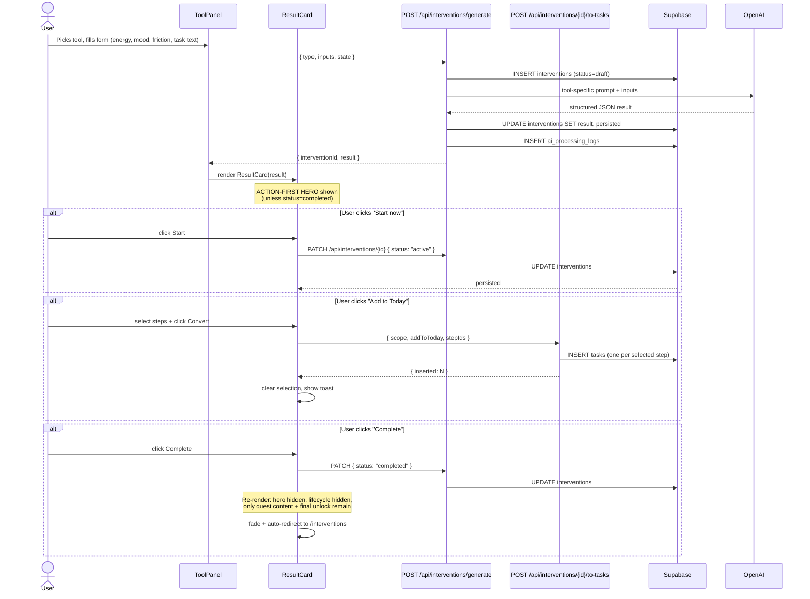

# Flow 003: Intervention generate → convert to tasks

## Goal
User feels stuck. Picks one of 4 intervention tools. Provides minimal context (energy + mood + the actual task/situation). Shadow generates a structured "unstick" plan. User optionally converts steps to actionable tasks in their Today list.

## Actor
Authenticated user on `/interventions/[tool]` page.

## Tools
1. **task_shatter** — break frozen task into tiny steps
2. **dopamine_menu** — energy-matched activity buffet
3. **context_switch** — physical/sensory/mental transition ritual
4. **interest_filter** — turn boring work into themed quest

## Sequence



## Files
- `src/app/(app)/interventions/[tool]/page.tsx` — route shell
- `src/components/interventions/ToolPanel.tsx` — input form + hydrate latest draft
- `src/components/interventions/ResultCard.tsx` — output card + lifecycle controls
- `src/components/interventions/StateInputPanel.tsx` — energy/mood/friction chips
- `src/components/interventions/stateStore.ts` — localStorage persistence of state chips
- `src/components/interventions/StuckRightNowPanel.tsx` — dashboard widget
- `src/app/api/interventions/generate/route.ts` — LLM generation
- `src/app/api/interventions/[id]/route.ts` — PATCH status
- `src/app/api/interventions/[id]/to-tasks/route.ts` — convert steps to tasks
- `src/app/api/interventions/[id]/save-memory/route.ts` — flag as repeatable pattern
- `src/ai/prompts/interventions.ts` — 4 system prompts (one per tool)

## State Machine

```
draft → active → completed
              ↘
                archived
              ↘
                dismissed
```

- `draft` — generated but not started; can regenerate freely
- `active` — user committed; Start Now clicked
- `completed` — user marked done; UI hides hero + lifecycle (only quest content visible)
- `archived` — user shelved without finishing
- `dismissed` — user rejected (rare)

## Edge Cases

### "New intervention +" link reuses form state
Solved by `skipNextHydrate` ref pattern in `ToolPanel.tsx`. Resetting via the button skips the next hydrate effect run, preventing latest-draft re-fill.

### Selection checkboxes persist after convert
After successful convert action, `setSelected(new Set())` clears them.

### Completed card showing irrelevant action buttons
Wrapped action hero + lifecycle row + conversion drawer in `{status !== "completed" && ...}`.

### User clicks Start Now twice
Button is disabled while `busy === "status"`; second click is a no-op.

### Long generation (10+ seconds)
ShadowLoader shows in ToolPanel; user can navigate away — generation completes in background and `?id=` URL updates.

## Invariants
- Generation always writes to DB before returning (no orphan results)
- State chips persist across sessions via localStorage
- Convert is idempotent at the row level (one task per selected step)
- Status transitions are persisted server-side; client mirrors via `setStatusBoth`
- Cost ledger entry written for every generate call
