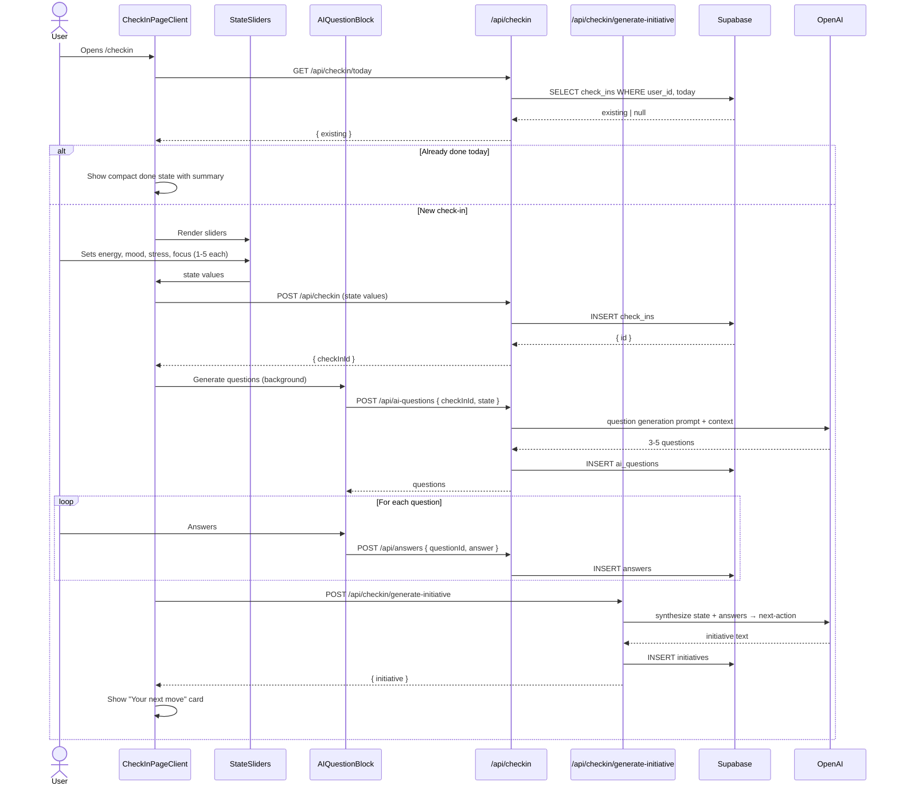

# Flow 004: Daily check-in wizard

## Goal
Once per day, user runs a 60-90 second structured check-in: state sliders (energy, mood, stress, focus), 3-5 AI-generated questions, optional reflection.

## Actor
Authenticated user on `/checkin` (auto-opens on dashboard if not done today).

## Sequence

## Files
- `src/app/(app)/checkin/page.tsx` — server entry
- `src/components/checkin/CheckInPageClient.tsx` — client orchestrator
- `src/components/checkin/StateSliders.tsx` — energy/mood/stress/focus sliders
- `src/components/checkin/AIQuestionBlock.tsx` — generated questions
- `src/components/dashboard/CheckInHero.tsx` — dashboard launcher card
- `src/app/api/checkin/route.ts` — create check-in
- `src/app/api/checkin/today/route.ts` — fetch today's check-in
- `src/app/api/checkin/generate-initiative/route.ts` — synthesize next action
- `src/app/api/ai-questions/route.ts` — generate questions
- `src/app/api/answers/route.ts` — store answers
- `src/lib/check-in.ts` — server helpers

## Schema (per day)
- `check_ins` — one row with state values
- `ai_questions` — 3-5 rows linked to check-in
- `answers` — 0-5 rows linked to questions
- `initiatives` — optional row with synthesized action

## Edge Cases

### User leaves mid-wizard
- Check-in row exists with state values; questions may or may not be generated
- Returning to `/checkin` resumes from where left off
- Dashboard hero shows "Continue check-in →"

### User answers nothing
- Still gets daily report (uses state + any classified entries)
- Initiatives generation skipped

### Multiple check-ins per day
- Allowed (migration `20260523_checkin_multi_per_day.sql`)
- Latest counts for streak; all visible in journey

### Mood not filled during analysis
- Daily report falls back to most recent check-in within last 24h
- If no check-in: report uses entry sentiment as mood proxy

### Slider reset bug
- All sliders reset to neutral (3 of 5) on mount
- Existing values from today are pre-loaded if check-in already saved

## Invariants
- Check-in IDs are stable; `check_ins.id` referenced by `ai_questions`, `initiatives`
- Questions are generated *after* state is saved, not before (state informs questions)
- Initiatives are *optional* — wizard completion doesn't require them
- All inserts are RLS-scoped to `auth.uid()`
