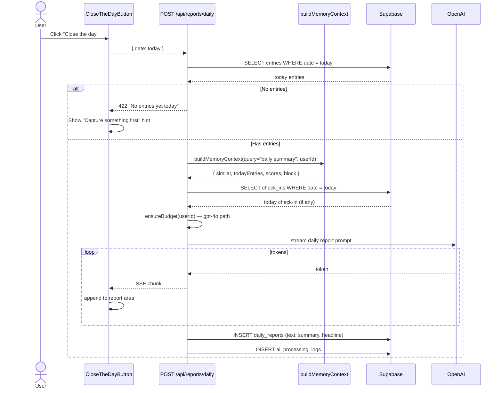

# Flow 005: End-of-day report generation

## Goal
At any point in the evening, user clicks "Close the day". Shadow aggregates the day's entries + check-in + scores, generates a narrative report with patterns + suggested next moves.

## Sequence



## Files
- `src/components/reflection/CloseTheDayButton.tsx`
- `src/components/reflection/ReflectionSummary.tsx`
- `src/components/reflection/EveningRitual.tsx`
- `src/app/api/reports/daily/route.ts`
- `src/ai/prompts/daily-report.ts`
- `src/lib/memory/context.ts` — same `buildMemoryContext` as chat

## Report structure (LLM output)
```
HEADLINE   — one-line essence ("Day of split focus and small wins")
SUMMARY    — 3-5 sentences narrative
PATTERNS   — bullet list: what dominated, what was avoided
SIGNAL     — what changed vs. yesterday/last week
NEXT MOVE  — one specific suggested action for tomorrow
```

## Edge Cases

### No entries today (422)
Returns error; user sees "Capture something first" hint with link to inbox.

### No check-in today
Report uses entries only; mood inferred from entry sentiment.

### Budget exceeded
Falls back to gpt-4o-mini with a degraded prompt; banner notes "Lite report — budget reached".

### Report already generated today
Allowed to regenerate; new row created (latest wins in UI).

### LLM hallucinates a fact
Prompt enforces "cite specific entries by quoting fragments"; reviewer can flag via thumbs-down → `/api/shadow/feedback`.

## Invariants
- Always uses `gpt-4o` (deep) path when budget allows
- Memory block built fresh; no caching of context across days
- Report stored as text + structured fields for future querying
- Streaming response; user sees first words within ~1s
