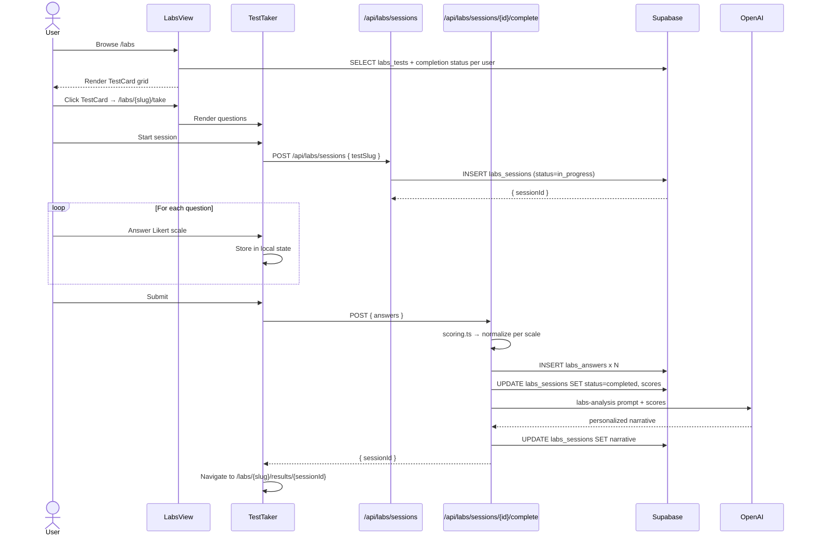

# Flow 006: Labs self-knowledge test

## Goal
User completes a structured self-knowledge test (Big 5, values, current state). Shadow scores results, generates personalized narrative, stores for persona enrichment.

## Sequence

## Files
- `src/app/(app)/labs/page.tsx` — index
- `src/app/(app)/labs/[slug]/page.tsx` — test detail
- `src/app/(app)/labs/[slug]/take/page.tsx` — wizard
- `src/app/(app)/labs/[slug]/results/[sessionId]/page.tsx` — results
- `src/components/labs/LabsView.tsx` — hero + index
- `src/components/labs/TestCard.tsx` — card with category accent
- `src/components/labs/SelfKnowledgeIndex.tsx` — progress ring
- `src/components/labs/TestTaker.tsx` — wizard
- `src/components/labs/ResultsView.tsx` — narrative + radar
- `src/components/labs/RadarChart.tsx` — viz
- `src/lib/labs/scoring.ts` — scale normalization
- `src/lib/labs/queries.ts` — server data loaders
- `src/ai/prompts/labs-analysis.ts` — narrative prompt

## Categories
| Category | Accent | Examples |
|----------|--------|----------|
| personality | `#6D7BFF` | Big 5 (OCEAN) |
| values | `#C9A36A` | 10 value domains (Schwartz) |
| state | `#6FBF8A` | Current state snapshot |

## Self-Knowledge Index
Aggregate completion % shown in `SelfKnowledgeIndex` ring on `/labs`. Fully calibrated = all available modules completed.

## Edge Cases

### User abandons mid-test
Session row remains in `in_progress` state. Returning to `/labs/{slug}/take` resumes with pre-filled answers from `labs_answers` table.

### User retakes test
New session created; previous remains in history. Latest counts for completion indicator.

### Scoring scale mismatch
`scoring.ts` validates each answer falls within the question's defined range; throws on mismatch (rare — usually a seeded data error).

### Narrative generation fails
Session completes with scores but no narrative. Results page shows scores + "Generate insights" retry button.

### Persona injection
Completed test narratives feed into `lib/ai-brain/context.ts` for any LLM call that needs persona context. Surfaced in chat as: "Given your Big 5 profile (high openness, low neuroticism), Shadow suggests..."

## Invariants
- Sessions are user-scoped (RLS); seeded test definitions are anon-readable
- Scoring is deterministic from answers (no LLM in the scoring step)
- LLM only generates the *narrative*, never the *scores*
- Retake creates a new session; history is preserved
