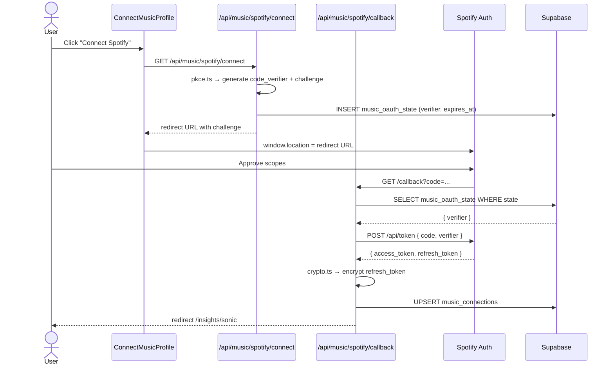
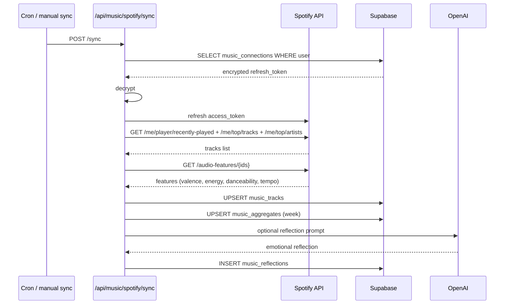

# Flow 007: Sonic Mirror — Spotify sync → emotional signal

## Goal
Connect Spotify once. Shadow periodically syncs listening data, analyzes audio features (valence, energy, tempo), surfaces it as ambient emotional signal in dashboard + memory.

## Sequence

### One-time OAuth (PKCE)

### Periodic sync

## Files
- `src/app/(app)/insights/sonic/page.tsx`
- `src/components/sonic/SonicMirrorMain.tsx`
- `src/components/sonic/ConnectMusicProfile.tsx`
- `src/components/sonic/SpotifyConnectCard.tsx`
- `src/components/sonic/SpotifySyncStatus.tsx`
- `src/components/sonic/CurrentSoundState.tsx`
- `src/components/sonic/DominantGenres.tsx`
- `src/components/sonic/SonicArchetype.tsx`
- `src/components/sonic/EmotionalAnchors.tsx`
- `src/app/api/music/spotify/connect/route.ts`
- `src/app/api/music/spotify/callback/route.ts`
- `src/app/api/music/spotify/sync/route.ts`
- `src/app/api/music/spotify/disconnect/route.ts`
- `src/app/api/music/sonic-reflection/route.ts`
- `src/lib/music/spotify.ts`
- `src/lib/music/pkce.ts`
- `src/lib/music/crypto.ts`
- `src/lib/music/analysis.ts`

## Signals derived

| Signal | Source |
|--------|--------|
| Current sound state | Last 24h tracks avg(valence, energy) |
| Listening shift | Δ valence/energy vs. last week |
| Dominant genres | Top artists genre rollup |
| Emotional anchors | User-tagged "this song = X feeling" |
| Sonic archetype | Long-term genre + features cluster |

## Edge Cases

### Token refresh fails
Disconnect flow triggered automatically; user sees "Reconnect Spotify" card on insights page.

### Spotify rate limit (429)
Backoff with jitter; max 3 retries; surfaces "Sync delayed" toast.

### Audio features missing for a track
Track stored without features; analysis skips that row.

### User disconnects
`DELETE /api/music/spotify/disconnect` removes encrypted token + truncates `music_tracks` for user. Connection row marked `disconnected_at`.

### Refresh token encryption key rotation
`crypto.ts` reads `MUSIC_TOKEN_KEY` env. Rotation requires re-prompting all users to reconnect (acceptable since single-user MVP).

## Privacy
- Encrypted at rest: refresh tokens via AES-GCM with server-side key
- Never sent to client: refresh tokens stay server-only
- User can disconnect + purge in one click
- No track-level data shared with OpenAI; only aggregates (mood vectors)

## Invariants
- One Spotify connection per user
- OAuth state has 10-minute expiry
- All Spotify endpoints behind `lib/music/spotify.ts` wrapper
- Sync is idempotent (UPSERT on `(user_id, track_id)`)
