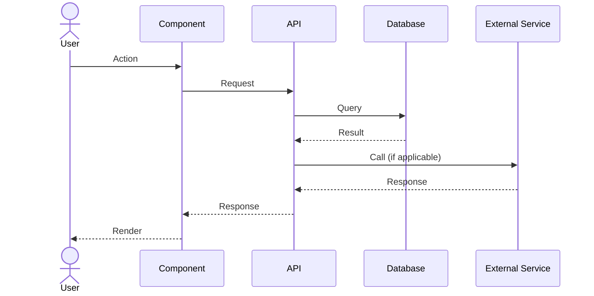

# Flow NNN: Title

## Goal
What is the user trying to accomplish?

## Actor
Who initiates this flow? (Authenticated user, system cron, webhook, etc.)

## Sequence

## Files
- `path/to/component.tsx` — what it does
- `path/to/api/route.ts` — what it does
- `path/to/lib/helper.ts` — what it does

## Timing (real-world)
| Step | Duration |
|------|---------|
| Step name | Xms |

## Edge Cases

### Case 1
How it's handled.

### Case 2
How it's handled.

## Invariants
- What must always be true at the end of the flow.
