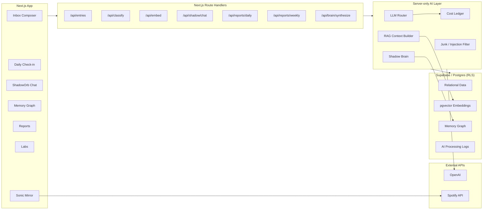

# Shadow — AI Second Brain

[](https://github.com/Qalipso/Shadow-AI-Second-Brain/actions/workflows/ci.yml)

**A personal AI memory system that turns messy daily input into structured memory, patterns, and decisions.**

Shadow is not a task manager, journal, habit tracker, or Notion clone.

It is an external cognitive layer: you write what is happening in your life, and the system classifies it, embeds it, stores it, connects it to past context, builds a memory graph, and uses that memory to help you reflect and decide.

> Capture chaos. Build memory. Notice patterns.

---

## Live Status

`MVP` · `single-user` · `text-first` · `dogfooded daily`

| Module | Status |
|---|---|
| AI Inbox / free-text capture | ✅ Live |
| Auto-classification | ✅ Live |
| 12 Life Areas wheel | ✅ Live |
| Daily check-in | ⚠️ Live — check-in→memory writes currently broken ([#18](https://github.com/Qalipso/Shadow-AI-Second-Brain/issues/18)) |
| Daily report | ✅ Live |
| Weekly review | ✅ Live |
| RAG memory with pgvector | ✅ Live |
| Shadow Brain memory synthesizer | ✅ Live |
| Typed Memory Graph | ⚠️ Live, visualization-only — not yet fed back into AI context ([#20](https://github.com/Qalipso/Shadow-AI-Second-Brain/issues/20)) |
| ShadowOrb memory chat | ✅ Live |
| AI interventions | ✅ Live |
| Labs / self-knowledge tests | ✅ Live |
| Direction / missions / tasks | ✅ Live |
| Rituals | ✅ Live |
| Sonic Mirror / Spotify signal | ✅ Live |
| Voice capture (Web Speech API) | ✅ Live |
| Mobile-first capture | ⏳ Planned |
| Multi-user version | ⏳ Planned |

> **Honest status.** This repo runs a public self-audit; statuses above are downgraded wherever an open issue contradicts "Live". Open Criticals not tied to a single module: LLM cost-cap bypass on the AI-summary route ([#19](https://github.com/Qalipso/Shadow-AI-Second-Brain/issues/19)), cost-cap race / `/api/embed` bypass ([#4](https://github.com/Qalipso/Shadow-AI-Second-Brain/issues/4)), account deletion doesn't cascade ([#3](https://github.com/Qalipso/Shadow-AI-Second-Brain/issues/3)). Full list: [open issues](https://github.com/Qalipso/Shadow-AI-Second-Brain/issues).

---

## Why this exists

Most personal productivity tools ask the user to do the organizing:

- choose the right app
- create the right folder
- assign the right tag
- remember the right context
- review the right pattern later

That breaks down when life is messy.

Shadow starts from a different product assumption:

> The user should be able to dump raw thought.
> The system should do the structuring.

The goal is to reduce the cognitive cost of self-management at the moment of capture, while turning scattered life input into compounding self-knowledge over time.

---

## Product Formula

```txt
Raw life input
  → AI classification
  → embeddings
  → typed memory
  → knowledge graph
  → pattern detection
  → reflection
  → next action
```

Shadow helps answer questions like:

- Why do I keep getting stuck on the same kind of work?
- What has been draining me this week?
- Which life areas am I ignoring?
- What goals keep appearing across my entries?
- What pattern is repeating that I am not noticing?
- What is the smallest next move from this state?

---

## What It Does

### 1. Capture

One textarea. The user can write anything: a thought, task, emotion, blocker, idea, decision, observation, win, or messy brain dump.

Shadow parses the entry into structured data:

```json
{
  "entity_type": "task | mood | idea | observation | decision | blocker | win",
  "life_areas": ["work", "health", "money"],
  "sentiment": -0.4,
  "urgency": 7,
  "suggested_action": "Break this into a smaller next step"
}
```

No manual tags. No folders. No productivity ceremony.

### 2. AI Classification

Every capture goes through a classification pipeline. The classifier detects:

- entry type
- related life areas
- emotional tone
- urgency
- suggested next action
- structured metadata for later retrieval

This turns chaotic input into a usable personal dataset.

### 3. RAG Memory

Each entry is embedded with `text-embedding-3-small` (1536 dims) and stored in Postgres with **pgvector**. When the user asks ShadowOrb a question, the system builds memory context from:

- semantically similar past entries
- today's entries
- life area scores
- recent patterns
- current user state

The goal is not generic chat. The goal is **context-aware recall over the user's own life data**.

### 4. Shadow Brain

Shadow Brain is the memory synthesizer. It runs after captures and turns raw entries into durable memory layers:

| Layer | Purpose |
|---|---|
| Typed memory items | Durable facts, preferences, goals, insights, current states |
| Graph nodes | People, projects, emotions, values, habits, risks, patterns |
| Graph edges | Relationships between concepts |
| Similarity links | Connections to past entries through vector search |

**Memory item types:** `profile` · `behavioral` · `preference` · `relationship` · `goal` · `current_state` · `insight` · `episodic`

**Graph relation examples:** `supports` · `blocks` · `triggers` · `causes` · `belongs_to` · `contradicts` · `related_to`

All inferred memory is treated as a **hypothesis**, not an absolute truth.

### 5. Memory Graph

Shadow includes an interactive memory graph built with **React Flow (`@xyflow/react`)**. The graph visualizes:

- typed nodes
- relationship edges
- repeated patterns
- goals and blockers
- projects and related emotions
- people and their connection to user state

The purpose is to make personal memory **inspectable** instead of hidden inside a black-box chat.

### 6. ShadowOrb Chat

ShadowOrb is the conversational interface over the memory system. It answers with context from previous entries, for example:

```
User: Why have I been feeling stuck this week?

ShadowOrb:
- You mentioned low energy in 3 entries.
- Work and Body were the most affected life areas.
- Two entries connect the stuck feeling to unfinished project tasks.
- Similar pattern appeared last month before you changed your routine.
- Suggested next move: reduce tomorrow to one concrete action before 12:00.
```

This is the core product bet: **an AI assistant becomes more useful when it has structured long-term memory and can reason across time.**

### 7. Reports and Patterns

Shadow generates reflection surfaces:

- daily report
- weekly review
- life area changes
- repeating mistakes
- dominant themes
- ignored areas
- suggested next moves

This makes the app less about "tracking" and more about **reflection loops**.

### 8. Interventions

AI-powered tools for moments when the user is stuck:

| Tool | Purpose |
|---|---|
| Task Paralysis Shatter | Breaks frozen tasks into tiny next steps |
| Dopamine Menu | Suggests energy-matched activities |
| Context Switch | Creates a physical / sensory / mental transition ritual |
| Interest Filter | Turns boring work into a themed quest |

These are not generic productivity tips — they use the user's context and state.

### 9. Labs

Labs are structured self-knowledge modules. Examples:

- Big 5 personality
- values
- current state
- identity reflection
- personal patterns

Lab results feed into the personalization layer, so Shadow can adapt its language and suggestions over time.

### 10. Sonic Mirror

Sonic Mirror connects Spotify listening data as an emotional signal. It can analyze:

- repeated tracks
- dominant genres
- mood shifts
- energy / valence patterns
- listening changes over time

The idea is not "music stats." The idea is: **your music taste can become another signal in your personal operating system.**

---

## Architecture



### Capture → Memory → Recall Flow

```
1. User writes:
   "Tired today. Couldn't focus on the proposal. Skipped gym."
2. Shadow stores the raw entry.
3. Classification detects:
   - entity type: mood + blocker
   - life areas: body, work
   - sentiment: negative
   - urgency: medium
4. Embedding pipeline stores semantic vector.
5. Shadow Brain extracts:
   - current_state: tired
   - blocker: proposal avoidance
   - habit signal: skipped gym
   - possible pattern: work overload → body neglect
6. Memory graph updates nodes and relationships.
7. Later, user asks: "Why do I feel off this week?"
8. ShadowOrb retrieves similar entries, today's context, and life-area scores.
9. Response connects current state to repeated past patterns.
```

---

## Tech Stack

| Layer | Tech |
|---|---|
| Framework | Next.js 16 (App Router) |
| Language | TypeScript |
| UI | React 19 |
| Styling | Tailwind CSS v4 + custom design tokens |
| Database | Supabase Postgres (RLS everywhere) |
| Vector search | pgvector |
| Embeddings | `text-embedding-3-small` (1536d) |
| LLM routing | OpenAI — `gpt-4o-mini` (hot path) / `gpt-4o` (reflection) |
| Auth | Supabase Auth (`@supabase/ssr`) |
| Graph UI | React Flow (`@xyflow/react`) |
| Animation | Motion (`motion/react`) |
| Validation | Zod |
| Music integration | Spotify API |
| Testing | Vitest + Playwright |
| Deployment | Vercel |

---

## Repository Structure

```txt
shadow/
├── web/                  Next.js application
│   ├── src/app/          App Router pages + API routes
│   ├── src/components/   Feature-grouped React components
│   ├── src/lib/          Server-only utilities, RAG, LLM, Supabase
│   ├── src/ai/prompts/   System prompts per pipeline
│   └── tests/            Vitest + Playwright suites
│
├── supabase/             Migrations + config
├── db/                   Schema documentation + seeds
├── ai/                   Prompt versions + RAG architecture
├── docs/                 PRD, personas, IA, user flows, metrics
├── design/               Tokens and design brief
├── Branding/             Positioning, messaging, audience, page architecture
├── planning/             Roadmap, sprints, backlog
├── reports/              Phase implementation reports
├── case-study/           Portfolio output
├── DECISIONS/            Architecture decision records
├── FLOWS/                Sequence diagrams and user flows
├── ARCHITECTURE.md       System design overview
├── ROADMAP.md            Sprint planning and future horizons
├── CHANGELOG.md          Release notes
└── README.md
```

---

## Engineering Highlights

**Memory-first architecture.** Shadow does not treat AI as a chat wrapper. The core engineering problem is memory: how to capture messy input, structure it, embed it, retrieve relevant context, synthesize durable memory, avoid turning hypotheses into false facts, and make memory inspectable through a graph.

**Server-only AI layer.** LLM calls, embeddings, RAG retrieval, Supabase access, and cost tracking stay on the server. Database access goes through an RLS-protected anon key (see [`DECISIONS/007-rls-everywhere.md`](DECISIONS/007-rls-everywhere.md)) — no service-role secret in the client bundle, and AI infrastructure stays separated from UI components.

**Cost-aware AI.** The system includes model routing ([`web/src/lib/llm.ts`](web/src/lib/llm.ts)) and a cost ledger ([`web/src/lib/cost-ledger.ts`](web/src/lib/cost-ledger.ts)) with a daily spend cap (`MAX_DAILY_LLM_USD`).

| Use case | Model |
|---|---|
| Classification (hot path) | `gpt-4o-mini` |
| Reports / area scoring | `gpt-4o` |
| RAG answers / Labs analysis | `gpt-4o` |

Models are env-overridable (`OPENAI_CLASSIFY_MODEL`, `OPENAI_REPORT_MODEL`). AI cost must be **visible and controlled**.

**Inferred memory is not treated as truth.** Shadow distinguishes user-confirmed facts, inferred hypotheses, temporary current state, episodic memories, and behavioral patterns. Personal AI systems can easily become overconfident — Shadow is designed to reflect patterns, not declare verdicts.

**Graph + RAG hybrid.**

| Memory type | Why it matters |
|---|---|
| Vector search | Finds semantically similar past entries |
| Typed memory | Stores durable structured knowledge |
| Knowledge graph | Makes relationships inspectable |
| Reports | Turns memory into reflection |
| Chat | Makes memory usable through conversation |

---

## Screenshots

> Add screenshots to `docs/assets/screenshots/` and replace the paths below.

| Dashboard | Memory Graph |
|---|---|
|  |  |

| ShadowOrb Chat | Daily Report |
|---|---|
|  |  |

---

## Demo Path

See [`docs/DEMO.md`](docs/DEMO.md) for the full 90-second walkthrough.

1. Open the dashboard.
2. Add a messy free-text entry in the Inbox.
3. Show how the entry is classified into life areas.
4. Open ShadowOrb and ask a memory-based question.
5. Show retrieved context / memory-based answer.
6. Open Memory Graph.
7. Show the Daily / Weekly report.
8. Open one intervention tool.
9. Show Sonic Mirror as an additional emotional signal.

---

## Example Use Case

**Input:**

```
"I feel tired again. I avoided the portfolio task for the third day.
I think I am scared it will not be good enough."
```

**Shadow classification:**

```
- type: blocker / mood / reflection
- life areas: work, creativity, identity
- sentiment: negative
- urgency: medium
- suggested action: break portfolio work into a smaller step
```

**Shadow Brain memory:**

```
- recurring pattern: avoidance around portfolio quality
- possible emotion: fear of judgment
- related goal: improve career positioning
- related project: portfolio
```

**ShadowOrb later:**

> "You have mentioned portfolio avoidance several times this week. The pattern is not laziness; it looks closer to evaluation fear. The smallest next move is not 'finish portfolio' — it is to improve one card."

---

## Documentation

| Document | Purpose |
|---|---|
| [`ARCHITECTURE.md`](ARCHITECTURE.md) | System overview, data flow, module breakdown |
| [`ROADMAP.md`](ROADMAP.md) | Sprint plan and product horizons |
| [`CHANGELOG.md`](CHANGELOG.md) | Release notes |
| [`DECISIONS/`](DECISIONS/) | Architecture decision records |
| [`FLOWS/`](FLOWS/) | Sequence diagrams and user journeys |
| [`docs/PRD.md`](docs/PRD.md) | Product requirements |
| [`docs/personas.md`](docs/personas.md) | Target user archetypes |
| [`docs/user-flows.md`](docs/user-flows.md) | End-to-end flows |
| [`docs/metrics.md`](docs/metrics.md) | Product metrics |
| [`docs/risks-tradeoffs.md`](docs/risks-tradeoffs.md) | Known risks and tradeoffs |
| [`ai/rag/memory-architecture.md`](ai/rag/memory-architecture.md) | RAG and memory design |
| [`ai/prompts/`](ai/prompts/) | Prompt versions |

---

## Quick Start

### Prerequisites

- Node.js 20+
- Supabase CLI
- OpenAI API key
- Spotify API credentials (optional, for Sonic Mirror)

### Install

```bash
cd web
npm install
```

### Environment

```bash
cp .env.local.example .env.local
```

Required:

```bash
NEXT_PUBLIC_SUPABASE_URL=
NEXT_PUBLIC_SUPABASE_ANON_KEY=
OPENAI_API_KEY=
MAX_DAILY_LLM_USD=1.50
NEXT_PUBLIC_APP_URL=http://localhost:3007
```

Optional:

```bash
OPENAI_CLASSIFY_MODEL=gpt-4o-mini
OPENAI_REPORT_MODEL=gpt-4o
SPOTIFY_CLIENT_ID=
SPOTIFY_CLIENT_SECRET=
SPOTIFY_REDIRECT_URI=http://localhost:3007/api/auth/spotify/callback
TOKEN_ENCRYPTION_KEY=
```

### Database

```bash
cd ../supabase
supabase db push

# seed the 12 life areas
psql -f ../db/seeds/life_areas.sql
```

### Development

```bash
cd ../web
npm run dev    # http://localhost:3007
```

### Tests

```bash
npm run test       # Vitest
npm run test:e2e   # Playwright
npm run typecheck
```

---

## Roadmap

**v0.1 — MVP** · single-user · text capture · AI classification · RAG memory · ShadowOrb chat · reports · interventions · Labs · Sonic Mirror

**v0.2 — Refinement** · mobile-responsive capture · improved onboarding · friends-and-family testing · weekly digest email · cost optimization · better memory inspection

**v1.0 — Multi-user** · billing · onboarding flow · admin dashboard · invite system · encrypted backup · mobile app shell

See [`ROADMAP.md`](ROADMAP.md) for detail.

---

## Product Principles

1. **Capture over categorize** — the user writes freely; the system organizes.
2. **Memory over storage** — entries should become useful context, not dead notes.
3. **Reflection over surveillance** — Shadow surfaces hypotheses, not judgments.
4. **Graph over black box** — the user can inspect what the system thinks it knows.
5. **Cost-aware AI** — a real AI product must track and control inference cost.
6. **Server-only secrets** — LLM, embeddings, RAG, and keys stay server-side.
7. **User-owned model** — personal memory should be exportable, deletable, and correctable.

---

## What This Project Demonstrates

A portfolio case for building production-style AI systems:

- RAG memory architecture
- semantic search with pgvector
- AI classification pipelines
- long-term memory synthesis
- graph-based knowledge modeling
- LLM model routing and AI cost tracking
- server-only AI infrastructure
- personal analytics UX
- product thinking around cognitive overload
- privacy-aware handling of inferred personal data

---

## License

MIT — see [LICENSE](LICENSE).
